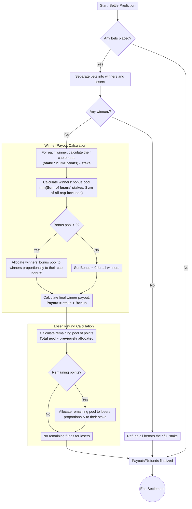

# prediction-bot

This bot is forked from the great https://github.com/jgoping/prediction-bot due to the original's relative lack of features and unmaintained status (last update was 4 years ago as of this writing). Go check it out if you want inspiration!

This is a Discord bot to run predictions, inspired by the Twitch prediction system but with a few additions to make it more Discord-like. When added to a server, anyone can begin a prediction with the !question command. Users in the server can predict with their points, and a mod or the person who asked the question can mark the question as ready for a payout when the result/outcomes is given. The payout in this is a bit more complicated than doubling points if correct, so it gets its own section at the end.

This bot is written in Node.js with the discord.js module.

## Commands

The commands available are split into three groups: those that anyone can perform (participating in the predictions), those that the creator of the question and the moderators can perform, and those that only the moderators can perform (running the predictions).

### General Commands
| Command          | Arguments                           | Description                                                    |
|------------------|-------------------------------------|----------------------------------------------------------------|
| /register        |                                     | Registers a user                                               |
| /predict         | [prediction num] [outcome] [amount] | Predict specified amount of points on the specified outcome    |
| /balance         | (@user)                             | View your balance or that of another user                      |
| /leaderboard     | (max users)                         | View all registered users balances, sorted in decreasing order |
| /openpredictions | (show answers)                      | View all open predictions, optionally with the valid answers   |
| /question        | [question] (allowed answers)        | Ask a question to predict on (default yes/no)                  |

### Creator + Moderator Command(s)
| Command    | Arguments                    | Description                                        |
|------------|------------------------------|----------------------------------------------------|
| /result    | [prediction num] [outcome]   | Submit the result of the prediction                |

### Moderator Commands
| Command    | Arguments                    | Description                                        |
|------------|------------------------------|----------------------------------------------------|
| /close     | [prediction num]             | Close the specified prediction and wait for result |
| /result    | [prediction num] [outcome]   | Submit the result of the prediction                |
| /refund    | [prediction num]             | Refund the points in the current prediction        |
| /setpoints | [@user] [amount]             | Set a user's points to the given amount            |

## How to set up
To add this to your local discord server, there are a few steps:
1. Create the Discord bot. For instructions to do this, [click here](https://github.com/jgoping/discord-voiceflow-bot#readme) and refer to the "Discord Setup" section. The bot token needs to be set in the `BOT_TOKEN` field of `config.json`.
2. Create a MySQL database. The password needs to be set in the `DB_PASSWORD` field of `config.json`, and the other fields can be set in the constructor of the class in `models/mysql.js`. The schema will look as follows:

| TABLE_NAME  | COLUMN_NAME       | DATA_TYPE |
|-------------|-------------------|-----------|
| bets        | bet_id            | bigint    |
| bets        | id                | varchar   |
| bets        | username          | text      |
| bets        | prediction_number | int       |
| bets        | predicted_outcome | text      |
| bets        | bet_amount        | int       |
| predictions | id                | varchar   |
| predictions | prediction_number | int       |
| predictions | question          | text      |
| predictions | allowed_answers   | text      |
| predictions | is_open           | tinyint   |
| users       | id                | varchar   |
| users       | username          | text      |
| users       | points            | int       |

3. Set the Discord ID of the moderators in the `MOD_LIST` field of `config.json`. For instructions to find a user's Discord ID, [click here](https://support.discord.com/hc/en-us/articles/206346498-Where-can-I-find-my-User-Server-Message-ID-).
4. Clone this repo, run `npm install`, then run the program with `npm start`.

## Config file options
In `config.json`, there are some properties that must be set as part of the set up process:
| Property        | Default Value | Description                                     |
|-----------------|---------------|-------------------------------------------------|
| BOT_TOKEN       |               | Token of the Discord bot to connect to          |
| CLIENT_ID       |               | ID of the Discord bot to connect to             |
| GUILD_ID        |               | ID of the server to register slash commands for |
| DB_PASSWORD     |               | Password to connect to the MySQL Database       |
| INITIAL_BALANCE | 10000         | Balance a user gets when they register          |
| MAX_BET         | 250000        | The maximum bet size                            |
| MIN_BET         | 100           | The minimum bet size                            |
| MOD_LIST        |               | List containing Discord IDs of moderators       |
| NAME_MAPPING    |               | Map of Discord IDs to names (optional)          |

## Payout
When a prediction gets answered with `/result`, the payout math is detailed in the following mermaid.js diagram:

This math was designed to keep a fixed amount of money in the system at any given time while remaining fair. The diagram was produced with the following mermaid code:
